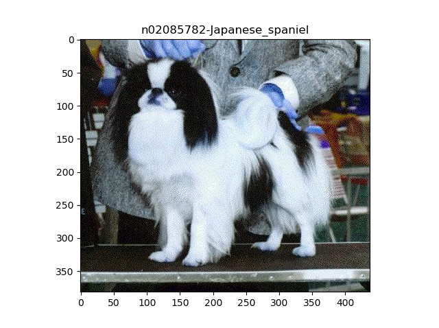

# bag-of-words
Forked from https://github.com/bikz05/bag-of-words

## Dependencies

The application runs on **python3.6.5** with **opencv release 3.4.0.12**

```
pip install opencv-python==3.4.0.12
pip install opencv-contrib-python==3.4.0.12
```

## Training the classifier
```
python findFeatures.py -t dataset/train/
```

## Testing the classifier
* Testing a number of images
```
python getClass.py -t dataset/test --visualize
```
The `--visualize` flag will display the image with the corresponding label printed on the image/

* Testing a single image
```
python getClass.py -i dataset/test/n02085782-Japanese_spaniel/n02085782_126.jpg --visualize
```

<p align="center">
  
</p>

# Troubleshooting

If you get 

```python
AttributeError: 'LinearSVC' object has no attribute 'classes_'
```

error, then simply retrain the model. 
